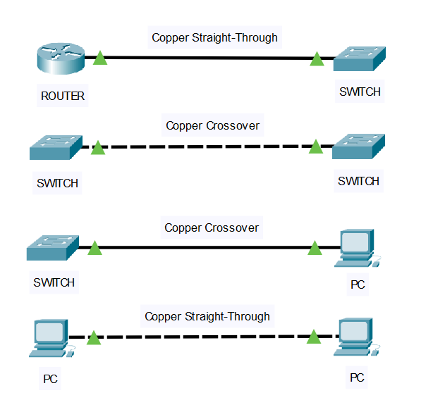

### Chapter 2, Apply: Cable Identification Practice

**Objective:** To practice selecting the correct cable types for connecting various network components and observe the link status.

**Lab Results and Analysis:**
I created several connections in Packet Tracer to test the cabling rules. The screenshot below shows the results.

1.  **Router to Switch:** Connected with a **Straight-Through** cable. The link is green, which is correct as they are 'unlike devices'.
2.  **Switch to Switch:** Connected with a **Crossover** cable. The link is green, which is correct as they are 'like devices'.
3.  **Switch to PC:** Connected with a **Crossover** cable. Although a Straight-Through cable is traditionally used for 'unlike devices', the link is green because modern devices have a feature called Auto-MDIX that automatically corrects for the wrong cable type.
4.  **PC to PC:** Connected with a **Straight-Through** cable. While a Crossover cable is traditionally required for 'like devices', the link is also green due to the Auto-MDIX feature.

**Conclusion:** This lab confirms the traditional cabling rules: use **Straight-Through** for unlike devices and **Crossover** for like devices, while also demonstrating that modern network interfaces can often automatically adjust for incorrect cabling.
