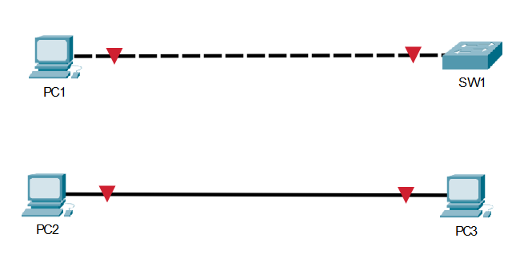

### Chapter 2, Visualize: Cabling Lab

**Objective:** To visually demonstrate the correct and incorrect cabling types for connecting "like devices" (switch to switch).

**Lab Setup:** I placed two 2960 switches in a Packet Tracer workspace to test the connections.

---
#### 1. Incorrect Cabling: Straight-Through Cable

When connecting the two switches with a **straight-through** cable, the link lights on the ports remained red. This indicates an invalid connection and that no link was established between the devices.

---
#### 2. Correct Cabling: Crossover Cable

After replacing the cable with a **crossover** cable, the link lights turned green after a few seconds. This indicates a valid link was established, and the switches can now communicate.

---
**Conclusion:** This lab confirms the fundamental cabling rule: **"like devices"** (e.g., switch to switch) require a **crossover cable** to communicate correctly.
