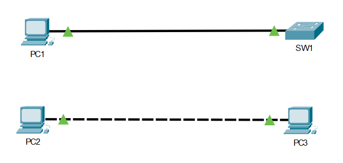

### Chapter 2, Visualize: Cabling Lab

**Objective:** To visually demonstrate the correct cabling types for connecting 'unlike devices' (PC to Switch) and 'like devices' (PC to PC).

---
#### 1. Correct Cabling Connections

As shown in the screenshot, a **straight-through** cable correctly connects 'unlike devices' (PC1 to SW1), resulting in green link lights. Similarly, a **crossover** cable correctly connects 'like devices' (PC2 to PC3), also resulting in a valid link.

---
#### 2. Incorrect Cabling Connections

Conversely, using the wrong cable types results in a down link, indicated by red lights. The screenshot shows a failed connection when using a **crossover** cable for 'unlike devices' (PC1 to SW1) and a failed connection when using a **straight-through** cable for 'like devices' (PC2 to PC3).

---
**Conclusion:** This lab confirms the fundamental cabling rules: use **straight-through** cables for unlike devices and **crossover** cables for like devices.
